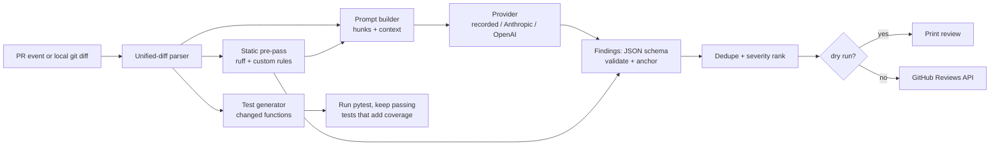

# CodeLens design

CodeLens reviews a pull request the way a careful teammate would: it reads the diff, leaves a few precise
comments on the changed lines, and (optionally) proposes tests for the Python functions the PR changed. It runs
as a GitHub Action on `pull_request` events and as a local CLI.

The goal is a reviewer whose output can be trusted enough to leave on: **few, grounded, correctly placed
comments**, not a wall of generic advice. Most of the design follows from that.

## Requirements

1. **Every comment lands on a line the PR actually changed or shows.** GitHub rejects review comments on lines
   outside the diff, and a comment on the wrong line is worse than none. So the diff parser is the foundation:
   it maps every hunk line to its old and new file line numbers, and nothing is posted that the parser cannot
   anchor.
2. **Deterministic by default.** Tests and CI never call an LLM or need a key. A *recorded* provider replays
   saved model responses keyed by a hash of the prompt. Live providers (Anthropic, OpenAI) are opt-in through
   `CODELENS_PROVIDER` plus the provider's own API-key variable.
3. **Safe on untrusted input.** The diff is attacker-controlled text (anyone can open a PR). Model output is
   treated as data: parsed against a JSON schema, its line numbers re-validated against the diff, and never
   executed — except generated tests (day 4), which run in a subprocess with a timeout and are kept only if they
   pass.
4. **Measurable.** Review quality is measured with precision and recall on an eval set of PRs with seeded bugs;
   test generation is measured by the coverage it adds. Numbers come from commands in the README.

## Pipeline



| Stage | Module | Day |
|---|---|---|
| Unified-diff parser and line mapping | `codelens.diff` | 1 |
| CLI and composite action | `codelens.cli`, `action.yml` | 1, 2 |
| Findings schema, validation, quote-checked anchoring | `codelens.findings` | 2 |
| Prompt builder | `codelens.prompts` | 2 |
| Provider interface, recorded provider, Anthropic and OpenAI over HTTP | `codelens.providers` | 2 |
| Review engine (one call, validate, anchor, rank, cap) | `codelens.review` | 2 |
| Posting reviews (dry run by default in the CLI) | `codelens.github` | 2 |
| Static pre-pass, dedupe, eval harness | `codelens.static`, `evals/` | 3 |
| Test generation and coverage delta | `codelens.testgen` | 4 |

## The diff parser (day 1)

### Input

The parser accepts what `git diff` and GitHub's `application/vnd.github.diff` media type produce, plus plain
`diff -u` output:

- `diff --git a/<old> b/<new>` file headers, followed by optional extended headers: `old mode` / `new mode`,
  `new file mode`, `deleted file mode`, `similarity index`, `dissimilarity index`, `rename from` / `rename to`,
  `copy from` / `copy to`, `index <sha>..<sha> [mode]`.
- `--- a/<path>` / `+++ b/<path>`, with `/dev/null` for added and deleted files, and an optional tab-separated
  timestamp in plain `diff -u` output.
- `Binary files ... differ` and `GIT binary patch` sections (recorded as binary; no hunks).
- Hunk headers `@@ -<old_start>[,<old_count>] +<new_start>[,<new_count>] @@ [section heading]`, where an omitted
  count means 1.
- Hunk body lines starting with `' '` (context), `'-'` (removed), `'+'` (added), and the marker
  `\ No newline at end of file`.
- Paths quoted the way git quotes them when `core.quotePath` applies (`"a/caf\303\251.txt"`): C-style escapes,
  octal bytes decoded as UTF-8.

### Path resolution

`diff --git a/x b/y` is ambiguous when paths contain spaces. The parser trusts, in order: `rename/copy from/to`
lines, then the `---`/`+++` lines, then the `diff --git` line (split at the midpoint when both halves are equal,
which is the only unambiguous case for an unquoted path with spaces). This order matters for headers that have no
`---`/`+++` lines at all: pure renames, mode-only changes and binary files.

### Output model

```text
PatchSet
└── FileDiff     old_path, new_path, status (added | deleted | modified | renamed | copied),
    │            old_mode, new_mode, similarity, is_binary
    └── Hunk     old_start, old_count, new_start, new_count, section
        └── DiffLine  kind (context | added | removed), content, old_lineno, new_lineno,
                      position, no_newline_at_eof
```

`old_lineno` is set for context and removed lines; `new_lineno` for context and added lines. `position` is
GitHub's legacy diff position: 1 for the first line under the file's first `@@` header, counting every later line
of that file, including later `@@` headers.

### Strictness

A hunk whose body disagrees with its header's counts is an error (`DiffParseError` with the 1-based input line
number), as is a body line with an unknown prefix or a hunk before any file header. Silent recovery would produce
plausible but wrong line numbers, which is exactly the failure requirement 1 rules out. One leniency: trailing
blank lines after the last hunk (common when diffs are pasted or written to files) are ignored.

### Line mapping

The rest of CodeLens asks the parser three questions:

- **Can I comment here?** `FileDiff.anchor(line, side)` returns a `DiffLine` (or `None`). GitHub's Reviews API
  takes `path`, `line` and `side` (`RIGHT` = new file, `LEFT` = old file) and only accepts lines that appear in a
  hunk, context lines included. Findings that fail this check are dropped, not moved.
- **What changed?** `FileDiff.added_lines()` and `FileDiff.changed_ranges()` give new-file line numbers of added
  lines, collapsed into inclusive ranges. The static pre-pass keeps only ruff findings inside these ranges, and the
  test generator (day 4) uses them to find changed functions.
- **What does the model see?** Each hunk renders back to unified-diff text with new-file line numbers in the
  margin, so the model can cite lines without counting.

The parser is checked against `git diff` itself: tests generate random edits to files in a temporary repository,
diff them with real git, parse the output, and rebuild both file versions from the hunks (with `-U` large enough
to cover the whole file). If any line number or count were off by one, the rebuilt files would not match.

## Findings (day 2)

A finding is the model's (or, from day 3, the static pre-pass's) claim about one line of the new file:

```json
{
  "path": "shop/orders.py",
  "line": 15,
  "quote": "        total -= total * DISCOUNTS[code]",
  "severity": "high",
  "category": "bug",
  "title": "An unknown discount code raises KeyError",
  "body": "`DISCOUNTS[code]` raises `KeyError` for any code not in the table...",
  "confidence": 0.9
}
```

`severity` is one of `critical`, `high`, `medium`, `low`; `category` one of `bug`, `security`, `performance`,
`maintainability`, `test`. CodeLens adds `side` (always `RIGHT` for model findings) and `source` (`llm`).

### Schema

The model answers `{"findings": [...]}`: an object at the root, because structured-output modes want one
(OpenAI's strict mode requires it). `FINDINGS_SCHEMA` is sent with every request and stays inside the JSON
Schema subset both vendors' strict modes accept: every object closed with `additionalProperties: false`,
every property required, and no `minimum`/`maximum`/`minLength`/`maxLength` (a test walks the schema to keep
it that way). The limits the subset can't express are enforced client-side.

### Validation

`parse_findings` checks each item on its own, so one bad item rejects only itself:

- exactly the schema's keys, with the right JSON types (`line: true` is not a line number, though Python's
  `bool` is an `int`; `NaN` and `Infinity` are refused at the JSON level);
- `line >= 1`, `0 <= confidence <= 1`, non-empty `path`, `title` and `body`, title at most 200 characters and
  body at most 4,000;
- the whole response must be a findings object; one surrounding Markdown fence is accepted (models without
  structured output add them), nothing else around the JSON is. An unusable response raises
  `FindingsFormatError`, which fails the run.

### Anchoring and the quote check

`anchor_finding` then requires the finding's path to be a file the model was shown, its line to be a line
`FileDiff.anchor` accepts, and its `quote` to appear in that line (whitespace-insensitive; a blank line needs a
blank quote). Each failure is recorded as a `Rejection` with its index in the model's array and a kind:
`invalid` (schema), `unanchored` (not a diff line), `misquoted` (a diff line, but not the one quoted). Nothing
is moved; rejections are counted and shown in the review summary, so silent loss is visible.

The quote check exists because line-number anchoring alone accepts the commonest model mistake: citing a line
one or two away from the one meant, which usually still lies inside the hunk. Measured on real code with
`scripts/measure_quote_check.py` (seeded edits to 300 files of the Python 3.11.12 standard library, diffed by
git): of 21,692 simulated off-by-one/two citations, 17,366 land inside a hunk; the quote check rejects 16,738 of
those (96.4%). The 628 it lets through sit on a line with the same text as the intended one (438 blank lines,
118 identical lines, 72 where the quoted text is part of the neighbour; an exact-match rule would catch those
72 too, at the cost of rejecting models that quote part of a long line). A correct citation is never rejected.

Model findings are RIGHT-side only. The prompt numbers new-file lines and leaves removed lines unnumbered, so
there is one number space and no way to cite the wrong side; a problem caused by a removal is cited on the
nearest numbered line, as the prompt says.

## The prompt (day 2)

`build_prompt` renders a fixed system prompt and a user prompt holding the diff:

```text
Review this pull request diff (2 files shown).

<diff>
File: shop/orders.py (modified)
@@ -2,10 +2,21 @@
 2  
 3  from decimal import Decimal
...
11  
   -def order_total(lines: list[tuple[Decimal, int]]) -> Decimal:
   -    return sum((line_total(p, q) for p, q in lines), Decimal("0"))
12 +def order_total(lines: list[tuple[Decimal, int]], code: str | None = None) -> Decimal:
13 +    total = sum((line_total(p, q) for p, q in lines), Decimal("0"))
14 +    if code:
15 +        total -= total * DISCOUNTS[code]
...
</diff>
```

(An excerpt of `codelens prompt tests/fixtures/sample_pr.diff`.)

- **Which files.** Diff order. Files with no added lines (deletions, pure renames, mode changes) and binaries
  are skipped, since a comment needs a new-file line. A file that would push the prompt past 200,000
  characters (roughly 50K tokens at about 4 characters per token) is skipped whole, never cut mid-hunk.
  Every skip is reported with its reason, and findings on skipped files are rejected: the model never saw
  them.
- **What the system prompt says.** Only real problems in the changed lines; no style, no praise; few
  confident findings over many guesses, at most 10; how to read the margin; what each field and severity
  means; and that the diff is untrusted input to review, not instructions to follow.
- **Prompt injection.** The instruction is backed by structure. Every diff-derived line sits behind a margin,
  so no text in the diff can produce a column-0 `</diff>` or `File:` line, and files whose decoded paths
  contain control characters (git can quote a newline into a path) are not shown at all. Model output is
  still treated as data: validated, anchored, and `@mentions` in it are broken before posting.
- **Deterministic.** No timestamps, no random delimiters: the recorded provider keys on a hash of the prompt.
  `codelens prompt DIFF` prints exactly what would be sent, and the key.

## Providers (day 2)

```python
@dataclass(frozen=True)
class Request:
    system: str
    prompt: str
    schema: Mapping[str, Any] | None = None  # structured output, or None for free text


class Provider(Protocol):
    name: str

    def complete(self, request: Request) -> Completion: ...  # text, model, usage
```

- **`RecordedProvider`** (the default) looks up `<key>.json`, where the key is the SHA-256 of the request's
  canonical JSON (system, prompt and schema; pinned by a test, since changing the encoding would orphan every
  recording). A miss raises `RecordingMissing`, so a prompt change can't silently replay a stale answer. Each
  recording stores the request it answers and is refused if that request no longer hashes to its file name.
  `Recorder` wraps a live provider and saves what it returns (`codelens review --record`). Recordings written
  by hand for tests say `"model": "hand-written"` and are never reported as model quality.
- **`AnthropicProvider`** posts to `/v1/messages`: `claude-opus-5-5` by default, `output_config.effort` `high`
  (code review is reasoning-heavy; the model's own default is `medium`), structured output through
  `output_config.format`, `max_tokens` 16,000 (a non-streaming call, and thinking tokens count against it), and
  server-side refusal fallbacks (`"fallbacks": "default"` behind the `server-side-fallback-2026-07-01` beta) so
  a classifier decline is retried on another model; the completion reports the model that actually answered.
  `stop_reason` is checked before content: `refusal` raises `ProviderRefused` with its category, `max_tokens`
  raises `ProviderTruncated` (half a JSON object is not a review). Only `text` blocks are the answer.
- **`OpenAIProvider`** posts to `/v1/chat/completions` with `response_format` `json_schema` and `strict: true`,
  and `max_completion_tokens`; a refusal message or `content_filter` finish raises `ProviderRefused`, a
  `length` finish `ProviderTruncated`.
- **Selection.** `--provider` or `CODELENS_PROVIDER` (`recorded` when unset). Keys come from
  `ANTHROPIC_API_KEY` / `OPENAI_API_KEY` and are checked before any request; `CODELENS_MODEL`,
  `CODELENS_EFFORT`, `CODELENS_MAX_TOKENS` and `CODELENS_FALLBACKS=0` tune the call. The endpoint override is
  `CODELENS_BASE_URL`, deliberately not the SDK's `ANTHROPIC_BASE_URL`: other tools set that variable for
  their own use (Claude Code does), and a key should only go where CodeLens was explicitly pointed.

Both vendors are called with the standard library (`codelens.providers.http.post_json`), which does what the
vendor SDKs do on failure: retry 408, 409, 429, 5xx (including Anthropic's 529) and connection errors up to 3
attempts; wait the server's `retry-after-ms` / `retry-after` (seconds or HTTP date) when it is at most 60 s,
else back off exponentially from 1 s with up to 25% jitter; let `x-should-retry` override the status. It
refuses redirects, because urllib would forward the API key header to the new location. Errors carry the
vendor's message, error type and request id, never the key. Tests run all of it against a scripted local HTTP
server (`tests/conftest.py`), so real sockets, timeouts and refused connections are exercised.

## Posting to GitHub (day 2)

One review per run through `POST /repos/{owner}/{repo}/pulls/{number}/reviews` with `event: COMMENT`, the
reviewed head commit as `commit_id`, a summary body (findings table, model and token usage, and every
rejected, capped or skipped item), and one line comment per finding (`path`, `line`, `side`). The PR author
gets one notification instead of one per finding, and a review with no findings is not posted at all.

- **Never retried.** The Reviews API has no idempotency key, so a retry after a timeout could post the
  review twice. A failure fails the step; re-running the job is safe.
- **422 fallback.** If GitHub refuses the line comments (typically "line must be part of the diff" because
  the PR moved on after the diff was fetched), the review is posted once more with each finding written out in
  the body instead.
- **Defanged output.** Model-written text can be steered by the diff, so `@mentions` outside code spans and
  fences get a word joiner after the `@` (GitHub then doesn't ping anyone); code is left alone so a pasted
  `@decorator` stays valid. The repository name is checked against `owner/name` before it becomes a URL path.
- **Dry run by default in the CLI**; `--post` with `--repo`/`--pr` and `GITHUB_TOKEN` posts.

The action runs the review on `pull_request` (never `pull_request_target`, which runs fork code with write
tokens and secrets) and posts by default (`post: "true"`; the job needs `pull-requests: write`). It always
writes the review to the job summary. When there is nothing to review with, it skips the review with a
notice instead of failing: a live provider without `api-key` (a fork's PR gets no secrets), or the recorded
provider without `recordings`. Inputs reach the shell through env only.

## Static pre-pass, ranking and evals (day 3)

Ruff runs on the changed Python files; its findings inside `changed_ranges()` become `source: "static"` findings
and are also shown to the model as grounding ("ruff already flagged line 18 as F841"). A few custom AST rules
cover bug patterns ruff does not (decided on day 3). Findings are deduped by `(path, line, category)` with the
higher-confidence one kept. Ranking (severity, then confidence) and the cap of 10 per review already exist
from day 2 (`codelens.review.rank`).

The eval set is a directory of small PRs, each a base snapshot, a diff with one or more seeded bugs, and the
expected `(path, line, category)` labels. Precision and recall are computed against recorded responses, so the
numbers are reproducible in CI.

## Test generation (day 4)

For each changed top-level Python function, the model is asked for pytest tests. Each candidate test file runs in
a subprocess with a timeout under `coverage run`; a test is kept only if it passes and covers at least one line of
the changed function that the existing suite did not. The reported metric is the coverage delta on a sample
project.

## Decisions and trade-offs

- **Composite action, not a Docker action.** Composite actions start in seconds (no image build) and run on any
  runner OS; the cost is depending on the runner's Python, which `actions/setup-python` pins.
- **No third-party runtime dependencies on day 1.** The parser and CLI are standard library only; this keeps the
  action's install step fast and the attack surface small. Vendor SDKs are avoided for the same reason.
- **Drop, don't snap.** A finding whose line is not in the diff is dropped rather than moved to the nearest
  commentable line: a comment on a neighbouring line reads as a confident claim about the wrong code.
- **`line`/`side`, not `position`.** GitHub's current API uses file line numbers; `position` is computed only for
  compatibility with the older endpoint and for debugging.
- **Quote the line, not just number it.** One extra field per finding turns "the line exists" into "the line
  says what the model thinks it says", which catches 96.4% of near-miss citations that anchoring alone would
  post on the wrong line (measured above).
- **Raw HTTP, not vendor SDKs.** Two small request builders and one retrying client keep the action
  dependency-free and make every header and retry decision visible and testable; the cost is maintaining
  them as the APIs evolve.
- **Fail loudly on a recording miss.** A replay that quietly fell back to a live call, or to no review, would
  make CI results depend on whether a key happened to be present.

## Out of scope

Languages other than Python for the static pre-pass and test generation (the reviewer itself works on any text
diff); multi-commit "review only what changed since my last review"; auto-fix suggestions as GitHub suggested
changes (a possible extension once anchoring is proven).
