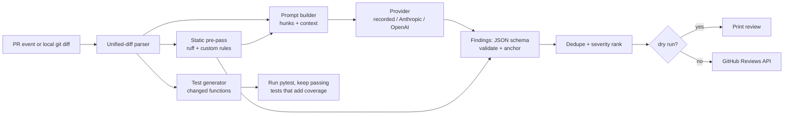

# CodeLens design

CodeLens reviews a pull request the way a careful teammate would: it reads the diff, leaves a few precise
comments on the changed lines, and (optionally) proposes tests for the Python functions the PR changed. It runs
as a GitHub Action on `pull_request` events and as a local CLI.

The goal is a reviewer whose output can be trusted enough to leave on: **few, grounded, correctly placed
comments**, not a wall of generic advice. Most of the design follows from that.

## Requirements

1. **Every comment lands on a line the PR actually changed or shows.** GitHub rejects review comments on lines
   outside the diff, and a comment on the wrong line is worse than none. So the diff parser is the foundation:
   it maps every hunk line to its old and new file line numbers, and nothing is posted that the parser cannot
   anchor.
2. **Deterministic by default.** Tests and CI never call an LLM or need a key. A *recorded* provider replays
   saved model responses keyed by a hash of the prompt. Live providers (Anthropic, OpenAI) are opt-in through
   `CODELENS_PROVIDER` plus the provider's own API-key variable.
3. **Safe on untrusted input.** The diff is attacker-controlled text (anyone can open a PR). Model output is
   treated as data: parsed against a JSON schema, its line numbers re-validated against the diff, and never
   executed — except generated tests (day 4), which run in a subprocess with a timeout and are kept only if they
   pass.
4. **Measurable.** Review quality is measured with precision and recall on an eval set of PRs with seeded bugs;
   test generation is measured by the coverage it adds. Numbers come from commands in the README.

## Pipeline



| Stage | Module | Day |
|---|---|---|
| Unified-diff parser and line mapping | `codelens.diff` | 1 |
| CLI and composite action | `codelens.cli`, `action.yml` | 1 |
| Provider interface, recorded provider, prompts, findings schema | `codelens.providers`, `codelens.review` | 2 |
| Posting reviews (dry-run by default locally) | `codelens.github` | 2 |
| Static pre-pass, dedupe, ranking, eval harness | `codelens.static`, `codelens.rank`, `evals/` | 3 |
| Test generation and coverage delta | `codelens.testgen` | 4 |

## The diff parser (day 1)

### Input

The parser accepts what `git diff` and GitHub's `application/vnd.github.diff` media type produce, plus plain
`diff -u` output:

- `diff --git a/<old> b/<new>` file headers, followed by optional extended headers: `old mode` / `new mode`,
  `new file mode`, `deleted file mode`, `similarity index`, `dissimilarity index`, `rename from` / `rename to`,
  `copy from` / `copy to`, `index <sha>..<sha> [mode]`.
- `--- a/<path>` / `+++ b/<path>`, with `/dev/null` for added and deleted files, and an optional tab-separated
  timestamp in plain `diff -u` output.
- `Binary files ... differ` and `GIT binary patch` sections (recorded as binary; no hunks).
- Hunk headers `@@ -<old_start>[,<old_count>] +<new_start>[,<new_count>] @@ [section heading]`, where an omitted
  count means 1.
- Hunk body lines starting with `' '` (context), `'-'` (removed), `'+'` (added), and the marker
  `\ No newline at end of file`.
- Paths quoted the way git quotes them when `core.quotePath` applies (`"a/caf\303\251.txt"`): C-style escapes,
  octal bytes decoded as UTF-8.

### Path resolution

`diff --git a/x b/y` is ambiguous when paths contain spaces. The parser trusts, in order: `rename/copy from/to`
lines, then the `---`/`+++` lines, then the `diff --git` line (split at the midpoint when both halves are equal,
which is the only unambiguous case for an unquoted path with spaces). This order matters for headers that have no
`---`/`+++` lines at all: pure renames, mode-only changes and binary files.

### Output model

```text
PatchSet
└── FileDiff     old_path, new_path, status (added | deleted | modified | renamed | copied),
    │            old_mode, new_mode, similarity, is_binary
    └── Hunk     old_start, old_count, new_start, new_count, section
        └── DiffLine  kind (context | added | removed), content, old_lineno, new_lineno,
                      position, no_newline_at_eof
```

`old_lineno` is set for context and removed lines; `new_lineno` for context and added lines. `position` is
GitHub's legacy diff position: 1 for the first line under the file's first `@@` header, counting every later line
of that file, including later `@@` headers.

### Strictness

A hunk whose body disagrees with its header's counts is an error (`DiffParseError` with the 1-based input line
number), as is a body line with an unknown prefix or a hunk before any file header. Silent recovery would produce
plausible but wrong line numbers, which is exactly the failure requirement 1 rules out. One leniency: trailing
blank lines after the last hunk (common when diffs are pasted or written to files) are ignored.

### Line mapping

The rest of CodeLens asks the parser three questions:

- **Can I comment here?** `FileDiff.anchor(line, side)` returns a `DiffLine` (or `None`). GitHub's Reviews API
  takes `path`, `line` and `side` (`RIGHT` = new file, `LEFT` = old file) and only accepts lines that appear in a
  hunk, context lines included. Findings that fail this check are dropped, not moved.
- **What changed?** `FileDiff.added_lines()` and `FileDiff.changed_ranges()` give new-file line numbers of added
  lines, collapsed into inclusive ranges. The static pre-pass keeps only ruff findings inside these ranges, and the
  test generator (day 4) uses them to find changed functions.
- **What does the model see?** Each hunk renders back to unified-diff text with new-file line numbers in the
  margin, so the model can cite lines without counting.

The parser is checked against `git diff` itself: tests generate random edits to files in a temporary repository,
diff them with real git, parse the output, and rebuild both file versions from the hunks (with `-U` large enough
to cover the whole file). If any line number or count were off by one, the rebuilt files would not match.

## Findings (day 2)

A finding is the model's (or the static pre-pass's) claim about one line:

```json
{
  "path": "src/app/payments.py",
  "line": 42,
  "side": "RIGHT",
  "severity": "high",
  "category": "bug",
  "title": "Refund amount can go negative",
  "body": "`amount - fee` is not clamped; a refund smaller than the fee yields a negative transfer.",
  "confidence": 0.8,
  "source": "llm"
}
```

`severity` is one of `critical`, `high`, `medium`, `low`; `category` one of `bug`, `security`, `performance`,
`maintainability`, `test`. The model is asked for a JSON array matching this schema; anything that fails schema
validation or anchoring is dropped and counted (the count is reported, so silent loss is visible).

## Providers (day 2)

```python
class Provider(Protocol):
    name: str
    def complete(self, system: str, prompt: str) -> str: ...
```

- `RecordedProvider` looks responses up by SHA-256 of `(system, prompt)` in a JSON fixtures directory and fails
  loudly on a miss, so a prompt change can't silently skip the model. A record mode, run by Vivek with a key,
  captures new fixtures.
- `AnthropicProvider` / `OpenAIProvider` call the vendor HTTP APIs with the standard library HTTP client; selected
  with `CODELENS_PROVIDER=anthropic|openai`, keys read from `ANTHROPIC_API_KEY` / `OPENAI_API_KEY`. Neither is
  used in tests or CI.

## Posting to GitHub (day 2)

One review per run through `POST /repos/{owner}/{repo}/pulls/{number}/reviews` with `event: COMMENT` and all
comments attached, so the PR author gets one notification instead of one per finding. The action's job needs
`pull-requests: write`. `--dry-run` prints the review payload instead of posting; it is the default for the CLI
and opt-out for the action.

The action triggers on `pull_request`, never `pull_request_target`: the latter runs with write tokens and secrets
on code from forks. On fork PRs secrets are unavailable, so the action falls back to the recorded provider in
dry-run mode and says so in the job log.

## Static pre-pass, ranking and evals (day 3)

Ruff runs on the changed Python files; its findings inside `changed_ranges()` become `source: "static"` findings
and are also shown to the model as grounding ("ruff already flagged line 18 as F841"). A few custom AST rules
cover bug patterns ruff does not (decided on day 3). Findings are deduped by `(path, line, category)` with the
higher-confidence one kept, then ranked by severity, then confidence, and capped (default 10 per review).

The eval set is a directory of small PRs, each a base snapshot, a diff with one or more seeded bugs, and the
expected `(path, line, category)` labels. Precision and recall are computed against recorded responses, so the
numbers are reproducible in CI.

## Test generation (day 4)

For each changed top-level Python function, the model is asked for pytest tests. Each candidate test file runs in
a subprocess with a timeout under `coverage run`; a test is kept only if it passes and covers at least one line of
the changed function that the existing suite did not. The reported metric is the coverage delta on a sample
project.

## Decisions and trade-offs

- **Composite action, not a Docker action.** Composite actions start in seconds (no image build) and run on any
  runner OS; the cost is depending on the runner's Python, which `actions/setup-python` pins.
- **No third-party runtime dependencies on day 1.** The parser and CLI are standard library only; this keeps the
  action's install step fast and the attack surface small. Vendor SDKs are avoided for the same reason.
- **Drop, don't snap.** A finding whose line is not in the diff is dropped rather than moved to the nearest
  commentable line: a comment on a neighbouring line reads as a confident claim about the wrong code.
- **`line`/`side`, not `position`.** GitHub's current API uses file line numbers; `position` is computed only for
  compatibility with the older endpoint and for debugging.

## Out of scope

Languages other than Python for the static pre-pass and test generation (the reviewer itself works on any text
diff); multi-commit "review only what changed since my last review"; auto-fix suggestions as GitHub suggested
changes (a possible extension once anchoring is proven).
