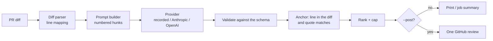

# CodeLens

An LLM pull-request reviewer and test generator that runs as a GitHub Action. It leaves a few precise comments
on the lines a PR changed, grounded by static analysis, and proposes pytest tests for changed Python functions,
keeping only the ones that pass and add coverage.

**Status: day 2 of 5.** Built so far: the unified-diff parser every comment is anchored through (day 1) and the
review engine (day 2): a provider interface with a recorded provider by default and opt-in Anthropic and
OpenAI providers, a findings schema with strict validation and quote-checked anchoring, one-review posting
to GitHub with a dry run, and the action's review step. The static pre-pass and eval set (day 3) and test
generation (day 4) are next. See [DESIGN.md](DESIGN.md) for the whole plan.

## How it works



1. The diff is parsed into files, hunks and lines, each with its old and new line numbers.
2. The prompt shows each reviewable file's hunks with new-file line numbers in the margin, and tells the model
   the diff is untrusted input.
3. The model answers a JSON object of findings (structured output). Each finding names a path, a line, the
   exact text of that line (`quote`), a severity, a category, a title, a body and a confidence.
4. Every finding is validated and anchored: the line must be in the diff and must say what the quote says.
   Anything that fails is dropped with a reason, never moved. Kept findings are ranked worst first and capped
   at 10.
5. The review is printed (dry run), written to the Actions job summary, or posted as one GitHub review with a
   line comment per finding.

## Use it

### CLI

```bash
git diff main... > pr.diff
codelens diff pr.diff                 # what is reviewable
codelens prompt pr.diff               # exactly what the model would be sent
codelens review pr.diff               # review it (recorded provider, dry run)
```

Output on the sample PR in this repo, replayed from its recording
(`codelens review tests/fixtures/sample_pr.diff --recordings tests/fixtures/recordings`):

```text
shop/orders.py:15  high  bug  An unknown discount code raises KeyError  (confidence 0.90)
shop/orders.py:22  medium  bug  Every page returns one order too many  (confidence 0.85)
tests/test_orders.py:7  low  test  No test for an unknown code or for pagination  (confidence 0.70)
3 findings on 2 reviewed files (recorded: hand-written, 0 input / 0 output tokens)
dropped 1: misquoted 1
  [2] misquoted: shop/orders.py:16 is 'return round(total, 2)', not 'total -= total * DISCOUNTS[code]'
dry run: nothing posted (pass --post to post the review)
```

That recording is **hand-written** test data (its third answer is a deliberate off-by-one citation, to show
the quote check dropping it); it is not model output. `--json` prints the same as JSON plus the exact Reviews
API payload; `--summary-file FILE` appends the review as Markdown.

### Live providers (opt-in)

Tests and CI never call a model or need a key. To review with a real model:

```bash
export ANTHROPIC_API_KEY=...          # or OPENAI_API_KEY with --provider openai
codelens review pr.diff --provider anthropic
codelens review pr.diff --provider anthropic --record --recordings .codelens/recordings   # save for replay
```

| Variable | Default | Meaning |
|---|---|---|
| `CODELENS_PROVIDER` | `recorded` | `recorded`, `anthropic` or `openai` (`--provider` wins) |
| `CODELENS_MODEL` | `claude-opus-5-5` / `gpt-5` | model for the live provider (`--model` wins) |
| `CODELENS_EFFORT` | `high` | Anthropic `output_config.effort`: `low` to `max` |
| `CODELENS_MAX_TOKENS` | `16000` | output limit; thinking tokens count against it |
| `CODELENS_FALLBACKS` | `1` | `0` turns off Anthropic's server-side refusal fallbacks |
| `CODELENS_BASE_URL` | vendor API | endpoint override (`ANTHROPIC_BASE_URL` is deliberately not read) |
| `CODELENS_RECORDINGS` | `.codelens/recordings` | where the recorded provider looks (`--recordings` wins) |

The Anthropic request asks for structured output matching the findings schema and opts into server-side
refusal fallbacks (`"fallbacks": "default"`), so a request a safety classifier declines is retried on another
model; the review reports which model answered. A refusal or a cut-off answer fails the run instead of
posting half a review.

### Posting

```bash
GITHUB_TOKEN=... codelens review pr.diff --provider anthropic --post --repo owner/name --pr 42 --commit "$SHA"
```

One review per run (`event: COMMENT`), so the author gets one notification. Posting is never retried (the
Reviews API has no idempotency key). If GitHub rejects the line comments with a 422, the review is posted once
more with the findings in its body. Findings an earlier CodeLens review already posted on the PR (matched by
an invisible fingerprint of file and line text) are not posted again, so pushing more commits doesn't repeat
old comments; a review with nothing new is not posted.

### GitHub Action

```yaml
# .github/workflows/codelens.yml
on: pull_request            # not pull_request_target: see DESIGN.md, "Posting to GitHub"
jobs:
  review:
    runs-on: ubuntu-latest
    permissions:
      contents: read
      pull-requests: write  # to post the review
    steps:
      - uses: actions/checkout@v7
      - uses: vivekdavara/codelens@main
        with:
          provider: anthropic
          api-key: ${{ secrets.ANTHROPIC_API_KEY }}
```

Inputs: `provider` (default `recorded`), `api-key`, `model`, `recordings`, `post` (default `"true"`),
`max-findings` (default 10), `max-prompt-chars` (default 200000), `diff-file`, `github-token`,
`python-version`. Outputs: `files`, `findings`, `rejected`, `diff-file`. The review
always goes to the job summary. On a fork's PR there are no secrets, so the review is skipped with a notice
rather than failing the job; the same happens for the recorded provider without `recordings`.

## Results so far

| What | Result | Reproduce |
|---|---|---|
| Tests | 289 passing | `.venv/bin/pytest` |
| Line + branch coverage | 99% overall: every module 100% except the day-1 parser, `diff.py`, at 97% | `.venv/bin/pytest --cov` |
| Quote check on near-miss citations | rejects 16,738 of 17,366 (96.4%) off-by-one/two citations that land inside a hunk, where line anchoring alone would accept them; 0 correct citations rejected | `.venv/bin/python scripts/measure_quote_check.py` |
| Real history | every commit of this repository parses and renders: 45 commits, 115 file diffs, 0 failures (another local clone, 50 Java/SQL/YAML commits: 0 failures) | `.venv/bin/python scripts/check_history.py [repo]` |
| Differential check against real git (day 1) | 150 seeded random edits: full-context hunks rebuild both files exactly; every line at default context matches its file line | `.venv/bin/pytest tests/test_diff_against_git.py` |
| Fuzzing the untrusted parsers | 1,500 seeded rounds each of random and mutated JSON for findings, both vendors' responses, error bodies and recordings: only documented errors raised; found one bug (negative token counts), fixed | `.venv/bin/pytest tests/test_fuzz.py` |
| The action, end to end | CI job `action-review` runs a full review of the sample PR through `action.yml` from its recording and checks 3 findings kept, 1 rejected | `.github/workflows/ci.yml` |

The quote-check measurement uses synthetic edits (seeded insertions, deletions and changed lines) on real
code: 300 sampled files of the Python 3.11.12 standard library, diffed by git, 5,423 commentable lines. The
3.6% it lets through land on a line whose text equals the intended one (438 blank lines, 118 identical lines,
72 where the quote is part of the neighbour). Off-by-one alone: 9,046 of 9,396 (96.3%)
(`scripts/measure_quote_check.py --offsets=-1,1`). A test keeps the rate on this repo's own sources above 90%
(95.1% today), so loosening the rule fails CI.

**Not measured yet:** review quality. Precision and recall need real model answers on an eval set of PRs with
seeded bugs (day 3); the only recording in this repo is hand-written, so no quality number is claimed.

## Develop

```bash
python3.11 -m venv .venv
.venv/bin/pip install -e '.[dev]'
.venv/bin/pytest
.venv/bin/ruff check . && .venv/bin/ruff format --check . && .venv/bin/mypy
```

The provider and GitHub tests run against a scripted local HTTP server (`tests/conftest.py`), so retries,
timeouts, refused redirects and error bodies are exercised over real sockets without any network access. After
changing the prompt or the schema, regenerate the sample recording with `scripts/hand_record.py` (the test
that fails tells you the command).

## Design decisions

- **Drop, don't snap; and quote, don't trust line numbers.** A finding must cite a line in the diff *and*
  quote it. A comment on a neighbouring line reads as a confident claim about the wrong code.
- **Recorded by default, loud on a miss.** CI is deterministic and keyless; a prompt change can't silently
  replay a stale answer.
- **The diff is untrusted.** The prompt says so, its structure can't be faked from inside the diff, and model
  output is data: validated, anchored, `@mentions` broken before posting.
- **Standard library only.** The vendors are called over raw HTTP with one retrying client: fast action
  installs, a small attack surface, and every header and retry decision is visible and tested.
- **One review, never retried.** One notification per run, and no duplicate reviews after a timeout.

More in [DESIGN.md](DESIGN.md); interview questions and answers in [WALKTHROUGH.md](WALKTHROUGH.md).

## License

MIT
