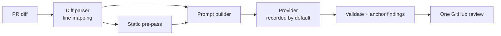

# CodeLens

An LLM pull-request reviewer and test generator that runs as a GitHub Action. It leaves a few precise comments
on the lines a PR changed, grounded by static analysis, and proposes pytest tests for changed Python functions,
keeping only the ones that pass and add coverage.

**Status: day 1 of 5.** Built so far: the design, the package, the composite action, and the unified-diff parser
that every review comment will be anchored through. The review engine (day 2), static pre-pass and eval set
(day 3) and test generation (day 4) are next. See [DESIGN.md](DESIGN.md) for the whole plan.

## How it works



Only the diff parser exists today. It turns `git diff` / GitHub `.diff` / `diff -u` output into files, hunks and
lines, each line carrying its old and new file line numbers and GitHub's diff position. `FileDiff.anchor(line,
side)` answers "can a review comment go here?", and anything that can't be anchored will be dropped rather than
moved to a nearby line.

## Use it

### CLI

```bash
git diff main... | codelens diff
```

Output on this repo's fixture (`codelens diff tests/fixtures/git_extended_headers.diff`):

```text
A added.txt  +1 -0  changed: 1
A dir with space/a file.txt  +1 -0  changed: 1
A empty.txt  +0 -0  changed: -
D gone.txt  +0 -1  changed: -
M img.bin  binary  changed: -
M keep.txt  +1 -1  changed: 3
R old_name.py -> new_name.py  +1 -1  changed: 4
M run.sh  +0 -0  changed: -
8 files, +4 -3
```

`codelens diff --json FILE` prints the same per file as JSON (status, paths, hunk and line counts, changed
ranges, number of commentable lines).

### GitHub Action

```yaml
# .github/workflows/codelens.yml
on: pull_request            # not pull_request_target: see DESIGN.md, "Posting to GitHub"
jobs:
  review:
    runs-on: ubuntu-latest
    permissions:
      contents: read
      pull-requests: read   # write from day 2, when it posts reviews
    steps:
      - uses: actions/checkout@v7
      - uses: vivekdavara/codelens@main
```

Today the action fetches the PR's diff and writes the reviewable lines to the job summary. Inputs: `diff-file`
(parse a file instead of fetching), `github-token`, `python-version`. Outputs: `diff-file`, `files`.

## Results so far

| What | Result | Reproduce |
|---|---|---|
| Tests | 61 passing | `.venv/bin/pytest` |
| Line + branch coverage | 98% (`diff.py` 97%, `cli.py` 100%) | `.venv/bin/pytest --cov` |
| Differential check against real git | 150 seeded random edits: full-context hunks rebuild both files exactly; every line at default context matches its file line | `.venv/bin/pytest tests/test_diff_against_git.py` |

The parser is also tested on real `git diff` output for added, deleted, renamed, copied, mode-only and binary
files, paths with spaces, and git-quoted paths (non-ASCII, embedded quotes, tabs) in `tests/fixtures/`.

## Develop

```bash
python3.11 -m venv .venv
.venv/bin/pip install -e '.[dev]'
.venv/bin/pytest
.venv/bin/ruff check . && .venv/bin/ruff format --check . && .venv/bin/mypy
```

No API keys are needed for anything in this repo: tests and CI never call an LLM. Live providers arrive on day 2
as an opt-in (`CODELENS_PROVIDER` plus the vendor's key variable).

## Design decisions

- **Strict parsing.** A hunk whose body disagrees with its header is an error with the input line number, not a
  guess: plausible-but-wrong line numbers would put comments on the wrong code.
- **Standard library only.** Fast action installs, small attack surface.
- **Composite action.** Starts in seconds with no image build.

More in [DESIGN.md](DESIGN.md).

## License

MIT
