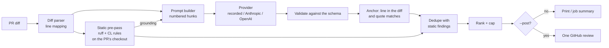

# CodeLens

An LLM pull-request reviewer and test generator that runs as a GitHub Action. It leaves a few precise comments
on the lines a PR changed, grounded by static analysis, and proposes pytest tests for changed Python functions,
keeping only the ones that pass and add coverage.

**Status: day 3 of 5.** Built so far: the unified-diff parser every comment is anchored through (day 1); the
review engine (day 2): a provider interface with a recorded provider by default and opt-in Anthropic and
OpenAI providers, a findings schema with strict validation and quote-checked anchoring, one-review posting
to GitHub with a dry run, and the action's review step; and (day 3) a static pre-pass (ruff plus four rules
of CodeLens's own) whose findings are posted and shown to the model, one dedupe rule across both sources,
and an eval set of 14 pull requests with seeded bugs scored by `codelens eval`. Test generation (day 4) is
next. See [DESIGN.md](DESIGN.md) for the whole plan.

## How it works



1. The diff is parsed into files, hunks and lines, each with its old and new line numbers.
2. The static pre-pass runs ruff (isolated from the PR's own config) and CodeLens's four rules on the Python
   files the PR changes, read from a checkout whose lines must match the diff. It keeps the problems the PR
   introduces: hits on added lines, and hits on unchanged lines that the old version (rebuilt from the file
   and the diff) didn't have.
3. The prompt shows each reviewable file's hunks with new-file line numbers in the margin, then the static
   findings as checked facts, and tells the model the diff is untrusted input.
4. The model answers a JSON object of findings (structured output). Each finding names a path, a line, the
   exact text of that line (`quote`), a severity, a category, a title, a body and a confidence.
5. Every finding is validated and anchored: the line must be in the diff and must say what the quote says.
   Anything that fails is dropped with a reason, never moved. Static and model findings are merged, one per
   (path, line, category), ranked worst first and capped at 10.
6. The review is printed (dry run), written to the Actions job summary, or posted as one GitHub review with a
   line comment per finding.

## Use it

### CLI

```bash
git diff main... > pr.diff
codelens diff pr.diff                 # what is reviewable
codelens static pr.diff               # the static pre-pass only (reads the files from . or --source-root)
codelens prompt pr.diff               # exactly what the model would be sent, static block included
codelens review pr.diff               # review it (recorded provider, dry run)
codelens eval                         # score it on the eval set (precision and recall)
```

`review` and `prompt` run the static pre-pass on `--source-root` (default `.`), which must be a checkout of
the diff's new version: a file whose lines don't match the diff is skipped and named in the output.
`--no-static` turns the pre-pass off. Without the `static` extra (`pip install 'codelens[static]'`, which
pins ruff 0.16.10) only CodeLens's own rules run, and the output says so.

Output on the sample PR in this repo, replayed from its recording
(`codelens review tests/fixtures/sample_pr.diff --recordings tests/fixtures/recordings`):

```text
shop/orders.py:15  high  bug  An unknown discount code raises KeyError  (confidence 0.90)
shop/orders.py:22  medium  bug  Every page returns one order too many  (confidence 0.85)
tests/test_orders.py:7  low  test  No test for an unknown code or for pagination  (confidence 0.70)
3 findings on 2 reviewed files (recorded: hand-written, 0 input / 0 output tokens)
dropped 1: misquoted 1
  [2] misquoted: shop/orders.py:16 is 'return round(total, 2)', not 'total -= total * DISCOUNTS[code]'
dry run: nothing posted (pass --post to post the review)
```

That recording is **hand-written** test data (its third answer is a deliberate off-by-one citation, to show
the quote check dropping it); it is not model output. `--json` prints the same as JSON plus the exact Reviews
API payload; `--summary-file FILE` appends the review as Markdown.

### Live providers (opt-in)

Tests and CI never call a model or need a key. To review with a real model:

```bash
export ANTHROPIC_API_KEY=...          # or OPENAI_API_KEY with --provider openai
codelens review pr.diff --provider anthropic
codelens review pr.diff --provider anthropic --record --recordings .codelens/recordings   # save for replay
```

| Variable | Default | Meaning |
|---|---|---|
| `CODELENS_PROVIDER` | `recorded` | `recorded`, `anthropic` or `openai` (`--provider` wins) |
| `CODELENS_MODEL` | `claude-opus-5-5` / `gpt-5` | model for the live provider (`--model` wins) |
| `CODELENS_EFFORT` | `high` | Anthropic `output_config.effort`: `low` to `max` |
| `CODELENS_MAX_TOKENS` | `16000` | output limit; thinking tokens count against it |
| `CODELENS_FALLBACKS` | `1` | `0` turns off Anthropic's server-side refusal fallbacks |
| `CODELENS_BASE_URL` | vendor API | endpoint override (`ANTHROPIC_BASE_URL` is deliberately not read) |
| `CODELENS_RECORDINGS` | `.codelens/recordings` | where the recorded provider looks (`--recordings` wins) |

The Anthropic request asks for structured output matching the findings schema and opts into server-side
refusal fallbacks (`"fallbacks": "default"`), so a request a safety classifier declines is retried on another
model; the review reports which model answered. A refusal or a cut-off answer fails the run instead of
posting half a review.

### Posting

```bash
GITHUB_TOKEN=... codelens review pr.diff --provider anthropic --post --repo owner/name --pr 42 --commit "$SHA"
```

One review per run (`event: COMMENT`), so the author gets one notification. Posting is never retried (the
Reviews API has no idempotency key). If GitHub rejects the line comments with a 422, the review is posted once
more with the findings in its body. Findings an earlier CodeLens review already posted on the PR (matched by
an invisible fingerprint of file, line text and position among identical lines, read only from CodeLens's
own comments) are not posted again, so pushing more commits doesn't repeat old comments; a review with
nothing new is not posted. Set `CODELENS_GITHUB_LOGIN` if CodeLens posts as something other than
`github-actions[bot]`.

### GitHub Action

```yaml
# .github/workflows/codelens.yml
on: pull_request            # not pull_request_target: see DESIGN.md, "Posting to GitHub"
jobs:
  review:
    runs-on: ubuntu-latest
    permissions:
      contents: read
      pull-requests: write  # to post the review
    steps:
      - uses: actions/checkout@v7
      - uses: vivekdavara/codelens@main
        with:
          provider: anthropic
          api-key: ${{ secrets.ANTHROPIC_API_KEY }}
```

Inputs: `provider` (default `recorded`), `api-key`, `model`, `recordings`, `post` (default `"true"`),
`max-findings` (default 10), `max-prompt-chars` (default 200000), `static` (default `"true"`),
`source-root` (default the workspace), `diff-file`, `github-token`, `python-version`. Outputs: `files`,
`findings`, `rejected`, `static` (how many of the findings came from the pre-pass), `diff-file`. On
`pull_request`, `actions/checkout` checks out the merge commit by default; files the base branch also
changed then differ from the PR's diff and are skipped by the pre-pass, so for every file to be checked use
`ref: ${{ github.event.pull_request.head.sha }}`. The review
always goes to the job summary. On a fork's PR there are no secrets, so the review is skipped with a notice
rather than failing the job; the same happens for the recorded provider without `recordings`. Only a review
of the PR's own diff is ever posted (never of a `diff-file`), pinned to the event's head commit; if a newer
push has landed by the time the diff is fetched, the review is skipped and that push's run reviews it.

## Results so far

### The eval set (day 3)

14 small pull requests, 12 of them with 23 seeded bugs and 2 clean, described in
[evals/README.md](evals/README.md). `codelens eval` reviews each one and scores what each source would post:

| Source | Cases scored | Findings | Correct | Precision | Bugs found | Recall |
|---|---|---|---|---|---|---|
| static pre-pass | 14 of 14 | 14 | 14 | 100.0% | 14 of 23 | 60.9% |
| model alone | 0 of 14 | not recorded | | | | |
| static + model (posted) | 0 of 14 | not recorded | | | | |

(`codelens eval`; a test pins the static row, so a rule change that loses a bug or adds a false positive
fails CI.) What these numbers are worth:

- **The static row is an upper bound.** The rules and the cases were written by the same author on the same
  day, and about half the bugs are of a kind a rule targets. The 9 it misses are the semantic ones a rule
  can't see: a `KeyError` on an unknown discount code, off-by-one pagination (two), a list mutated through
  `self.handlers[topic]` while iterating it, a swallowed timeout, a `None` cache entry dereferenced, tax
  rounded to whole dollars, path traversal, and a timing-unsafe token comparison.
- **The model rows are empty on purpose.** They need real model answers, and there was no API key on the
  machine that built this, so no number is claimed; hand-written answers would measure nothing. Recording
  them is one command (below, "Not measured yet").
- **The eval changed the design.** Its first run found that a PR making a method `async` turns its
  unchanged `time.sleep()` and `self.flush()` lines into bugs the pre-pass couldn't see, because it only
  read added lines. It now also reports new hits on unchanged lines (DESIGN.md, "Which files, and which
  lines").

### The static rules on mature code (day 3)

How often each rule fires on 296 files of the Python 3.11.12 standard library (128,452 lines), each
reviewed as if a PR had added it whole (`.venv/bin/python scripts/measure_static_noise.py`):

| Where | Hits | Per 1,000 lines |
|---|---|---|
| all files | 1,331 | 10.36 |
| test files (80,323 lines) | 1,180 | 14.69 |
| other files (48,129 lines) | 151 | 3.14 |

F841 (unused local) is 1,012 of the hits, 873 of them in one file, `test_exceptions.py`, which assigns
without reading on purpose; F821 is 127, 93 of them in `turtle.py`, which defines names with `exec`; 36 of
the 61 rules never fired. Most hits on shipped code are deliberate (the standard library calls `eval` and
`pickle` on purpose), so these are a ceiling on noise, not a false-positive rate. The first run found:

- **two real bugs in the standard library**: CL004 flagged `test/support/__init__.py` lines 923 and 2077,
  error messages written without the `f` prefix that print `{limit!r}` and `{max_depth}` literally;
- **two false-positive classes in CodeLens's own rules**, fixed with tests: CL003 on
  `for cookie in self: self.clear(domain, path, name)` in `http/cookiejar.py` (that's CookieJar's own
  `clear`, and the jar iterates a snapshot; CL003 now checks arities against the built-in methods), and
  CL004 on `.replace("{max_findings}", ...)` in CodeLens's own `prompts.py` (search tokens are now skipped).
  A test requires 0 hits on CodeLens's own sources.

### The static pre-pass on real pull requests (day 3)

Every non-merge commit of this repository, reviewed as a PR (`git diff C^ C`) against its own tree
(`.venv/bin/python scripts/measure_static_history.py`, at `22323ae`): 81 commits, 65 touching Python, 204
Python file diffs, 10,023 added Python lines, **15 findings**. Fourteen are the eval set's seeded bugs, in
the commit that added the cases (`eb6a818`). The fifteenth is a false positive: S105 ("possible hardcoded
password") on `TOKEN = "ghs_test_not_a_real_token"` in `tests/test_github.py`. S105 stays, at medium
severity and confidence 0.5, because a real secret pasted into a test is still a leak.

### Earlier days

| What | Result | Reproduce |
|---|---|---|
| Tests | 492 passing | `.venv/bin/pytest` |
| Line + branch coverage | 99% overall: every module 100% except the day-1 parser, `diff.py`, at 98% | `.venv/bin/pytest --cov` |
| Quote check on near-miss citations | rejects 16,738 of 17,366 (96.4%) off-by-one/two citations that land inside a hunk, where line anchoring alone would accept them; 0 correct citations rejected | `.venv/bin/python scripts/measure_quote_check.py` |
| Real history | every commit of this repository parses and renders: 48 commits, 122 file diffs, 0 failures at `8646d07` (another local clone, 50 Java/SQL/YAML commits: 0 failures) | `.venv/bin/python scripts/check_history.py [repo]` |
| Differential check against real git (day 1) | 150 seeded random edits: full-context hunks rebuild both files exactly; every line at default context matches its file line | `.venv/bin/pytest tests/test_diff_against_git.py` |
| Fuzzing the untrusted parsers | 1,500 seeded rounds each of random and mutated JSON for findings, both vendors' responses, error bodies and recordings: only documented errors raised; found one bug (negative token counts), fixed | `.venv/bin/pytest tests/test_fuzz.py` |
| The action, end to end | CI job `action-review` runs a full review of the sample PR through `action.yml` from its recording and checks 3 findings kept, 1 rejected; `action-static` reviews an eval case with the pre-pass and checks 2 findings, 1 static | `.github/workflows/ci.yml` |

The quote-check measurement uses synthetic edits (seeded insertions, deletions and changed lines) on real
code: 300 sampled files of the Python 3.11.12 standard library, diffed by git, 5,423 commentable lines. The
3.6% it lets through land on a line whose text equals the intended one (438 blank lines, 118 identical lines,
72 where the quote is part of the neighbour). Off-by-one alone: 9,046 of 9,396 (96.3%)
(`scripts/measure_quote_check.py --offsets=-1,1`). A test keeps the rate on this repo's own sources above 90%
(95.8%, 596 of 622, at `a220a7f`), so loosening the rule fails CI.

### Not measured yet

The model's review quality. With a key, one command records a real answer for every eval case (14 calls) and
prints all three rows:

```bash
ANTHROPIC_API_KEY=... .venv/bin/codelens eval --provider anthropic --record
```

The answers land in `evals/recordings/`, after which plain `codelens eval` (and CI) replays them.

## Develop

```bash
python3.11 -m venv .venv
.venv/bin/pip install -e '.[dev]'
.venv/bin/pytest
.venv/bin/ruff check . && .venv/bin/ruff format --check . && .venv/bin/mypy
```

The provider and GitHub tests run against a scripted local HTTP server (`tests/conftest.py`), so retries,
timeouts, refused redirects and error bodies are exercised over real sockets without any network access. After
changing the prompt or the schema, regenerate the sample recording with `scripts/hand_record.py` (the test
that fails tells you the command).

## Design decisions

- **Drop, don't snap; and quote, don't trust line numbers.** A finding must cite a line in the diff *and*
  quote it. A comment on a neighbouring line reads as a confident claim about the wrong code.
- **Recorded by default, loud on a miss.** CI is deterministic and keyless; a prompt change can't silently
  replay a stale answer.
- **The diff is untrusted.** The prompt says so, its structure can't be faked from inside the diff, and model
  output is data: validated, anchored, `@mentions` broken before posting.
- **Standard library only.** The vendors are called over raw HTTP with one retrying client: fast action
  installs, a small attack surface, and every header and retry decision is visible and tested.
- **One review, never retried.** One notification per run, and no duplicate reviews after a timeout.
- **Static findings are facts the model starts from, not a second opinion.** They are checked, posted as
  they are, and listed in the prompt; the model's own finding on the same line and category replaces one
  only when it ranks higher.
- **The PR doesn't configure its reviewer.** Ruff runs `--isolated` with CodeLens's own rule list, so a PR
  can't switch a rule off by editing `pyproject.toml`.
- **Report what the PR introduced.** Added lines, plus unchanged lines it made wrong; never what was already
  there.

More in [DESIGN.md](DESIGN.md); interview questions and answers in [WALKTHROUGH.md](WALKTHROUGH.md).

## License

MIT
